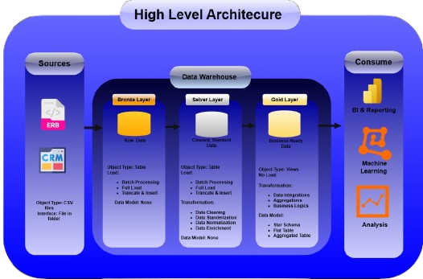
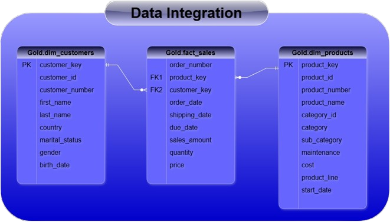
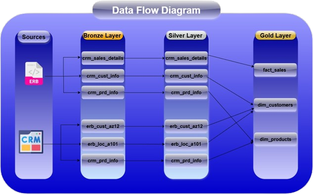
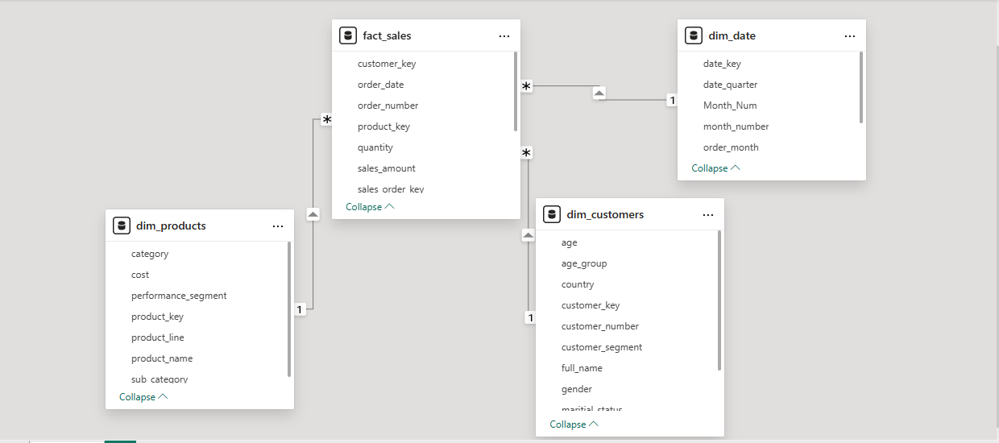
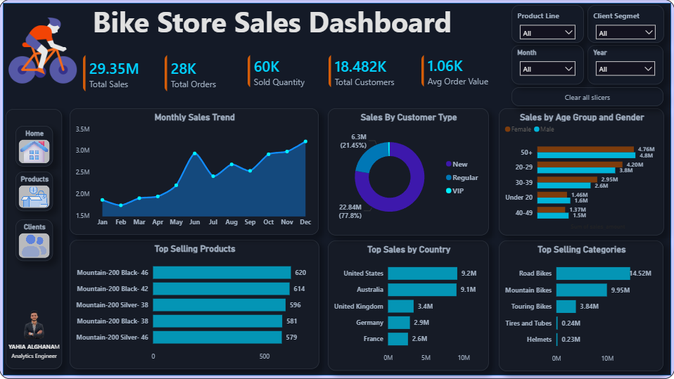
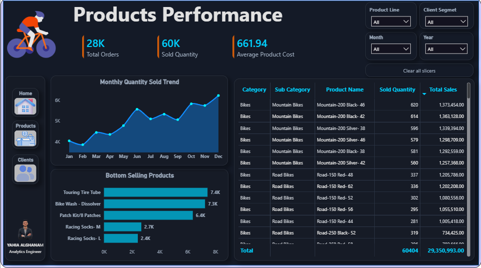

# Bike Store Data Warehouse & Analytics Project

This repository contains the end-to-end implementation of a scalable, robust Data Warehouse (DWH) tailored for retail analytics. The project converts raw, siloed flat-file inputs from separate **CRM** and **ERP** systems into an organized, optimized **Star Schema** within Microsoft SQL Server. It feeds interactive, professional executive dashboards built for tracking revenue, product demand, and customer lifecycle performance.

---

## 🏗️ Data Warehouse Architecture

The solution uses a  **Medallion Architecture (Bronze -> Silver -> Gold)** , ensuring absolute segregation between raw landing storage, structural data quality cleaning, and downstream semantic consumption matrices.

---

---
### 🟤 Bronze Layer (Staging)

* **Purpose:** Houses exact, un-manipulated mirrors of source raw infrastructure data.
* **Load Strategy:** Full Refresh via high-performance `BULK INSERT` with table-level locking optimizations (`TABLOCK`).
* **Ingestion Engine:** Orchestrated by a single comprehensive stored procedure (`bronze.load_bronze`) utilizing structured `TRY...CATCH` fault boundaries.

### ⚪ Silver Layer (Cleanse, Transform & Standardize)

* **Purpose:** Acts as the data quality and deduplication gatekeeping tier.
* **Operations:**
  * Removes unwanted padding spaces via `TRIM`/`LTRIM`/`RTRIM`.
  * Normalizes dates from generic numerical integer tracking representations (`YYYYMMDD`) to concrete system-assigned `DATE` objects using safe typecast functions (`TRY_CONVERT`).
  * Implements Slowly Changing Dimension (SCD Type 2) validation parameters through programmatic window analytical operations (`LEAD(...) OVER (...)`).
  * Deduplicates customer modifications using logical entry ranking constraints (`ROW_NUMBER()`).
  * Applies programmatic default replacements (`ISNULL`, `COALESCE`) to repair string null fields and negative numeric attributes.

### 🟡 Gold Layer (Semantic Reporting Marts)

* **Purpose:** Exposes structural business objects configured specifically for fast dashboard execution.
* **Design Pattern:** Star Schema consisting of one primary transactional fact table surrounded by descriptive dimension boundaries.
* **Objects:** Utilizes virtual abstract queries (`CREATE VIEW`) for core analytics objects alongside highly performant, materialized reporting tables (`fact_dim_customers_report`, `fact_dim_products_report`) to isolate complex segments such as customer lifecycle tiers (VIP, Regular, New) and performance ranges.

---

## 📊 Data Integration & Star Schema Design
---




---
The warehouse unifies records spanning disparate operational databases across critical transactional domains:

### Core Entity Linking Topology

* **Sales Transactions:** Rooted in the CRM sales pipeline, tracking orders, quantity thresholds, and prices.
* **Customer Integration:** Merges foundational identity structures from CRM (`crm_cust_info`) with granular ERP profiles (`erp_cust_az12`, `erp_loc_a101`) to append verified geographical records, localized ages, and gender categories.
* **Product Integration:** Normalizes CRM product catalog variants (`crm_prd_info`) against structural ERP hierarchical mappings (`erp_px_cat_g1v2`) to derive category and sub-category groupings.

### Star Schema Relationships

---


---
---
## 🛠️ Data Quality Suite (QA Framework)
---
A rigorous unit-testing script accompanies this deployment, ensuring structural integrity before execution pipelines process analytical inputs:

* **Primary Key Validation:** Groups identifier fields using `HAVING COUNT(*) > 1` rules to verify that zero duplicate rows exit structural transitions.
* **Domain & Schema Checks:** Validates string fields against un-trimmed formatting inputs (`WHERE field != TRIM(field)`).
* **Mathematical Consistency Audits:** Evaluates line financials to ensure values map cleanly to operational business constraints:
  $$
  \text{Sales Amount} = \text{Quantity} \times |\text{Unit Price}|
  $$
* **Chronological Audits:** Detects and flags record sequencing errors, ensuring shipment dates never occur before order placement timestamps (`WHERE sls_ship_dt < sls_order_dt`).

---

## 📈 Executive Dashboards & Analytics Insights

The optimized Gold semantic tier drives three comprehensive business views engineered for modern retail monitoring:

### 1. Executive Operations Overview
---

---
An enterprise operational interface displaying core financial KPIs at a glance.

* **Financial Metrics:** Tracking total sales volumes (29.35M), order processing caps (28K), and units sold (60K).
* **Trend Tracking:** Features chronological sales graphs charting dynamic peaks throughout mid-year periods.
* **Geographic Demographics:** Highlights distinct operational markets, revealing top market shares concentrated across the United States (9.2M) and Australia (9.1M).

### 2. Customer Lifecycle Performance
---

---
An analytical environment focused on demographic distribution and behavioral clustering.

* **Customer Metrics:** Identifies active market sizing (18.482K total profiles) alongside average sales value mappings (1.59K).
* **Demographic Slicing:** Groups user activity across distinct age bands, showing high revenue concentrations within the mature **50+** demographic and the active **20–29** workforce.
* **Segment Tracking:** Surfaces customer values across behavioral categories, indicating that **77.8%** of base revenue operations come from **VIP** account networks.

### 3. Product Demand Analysis
---

---
A tactical reporting deck focusing on operational product lines, costs, and inventory trends.

* **Product Performance:** Ranks items by sales volumes, pinpointing key revenue drivers like the *Mountain-200* and *Road-150* lines.
* **Category Dynamics:** Breaks down performance across core segments, establishing *Road Bikes* (14.52M) and *Mountain Bikes* (9.95M) as primary enterprise category channels.
* **Inventory Tuning:** Features a "Bottom Selling Products" quadrant, highlighting slower-moving stock items (e.g.,  *Racing Socks* ,  *Patch Kits* ) to inform inventory adjustments and strategic clearance events.

---

## 🚀 Deployment & Installation Guide

### Prerequisites

* Microsoft SQL Server 2019 or later.
* SQL Server Management Studio (SSMS).
* Power BI Desktop (to initialize dashboard layouts).

### Setup Pipeline Execution Sequence

1. **Schema Configuration:** Initialize physical database contexts by running the DDL scripts for the [Bronze Layer](https://www.google.com/search?q=https://github.com/your-repo/bronze_ddl.sql) and [Silver Layer](https://www.google.com/search?q=https://github.com/your-repo/silver_ddl.sql).
2. **Raw File Placement:** Extract the raw source CSV dataset files into your local directory or map paths appropriately in the staging configuration code.
3. **Ingestion:** Execute the raw data staging stored procedure:
   **SQL**

   ```
   EXECUTE bronze.load_bronze;
   ```
4. **Transformation Pipeline Run:** Execute the core transformation pipeline procedure to clean, conform, and rebuild tables:
   **SQL**

   ```
   EXECUTE silver.load_silver;
   ```
5. **Analytics Layer Configuration:** Run the [Gold Layer Views &amp; Tables](https://www.google.com/search?q=https://github.com/your-repo/gold_ddl.sql) configuration scripts to build reporting structures, dimensions, and fact entities.
